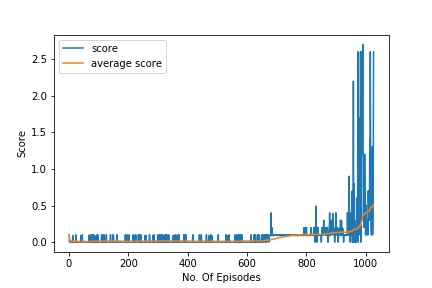

# Collaboration and Competition

## Deep Deterministic Policy Gradient Network agents for collaboration and competition to play tennis UnityML agent.

A  simple project to show how to implement an actor-critic policy gradient network agens using Python, PyTorch, and a ML-Agents environment. This project has been done as a part of Udacity Nanodegree in Deep Reinforcement Learning (DRL).

## Project Structure:
```
├───.ipynb_checkpoints
├───images
├───plots
├───python
│   ├───communicator_objects
│   ├───curricula
│   ├───tests
│   ├───unityagents
│   └───unitytrainers
│       ├───bc
│       └───ppo
│ model.py
│ Tennis.ipynb
│ README.md
│ memory.py
| noise.py
| utils.py
│ Report.pdf
│ test_agent.py
│ train_agent.py
│ ddpg_agent.py
│ maddpg.py
│ unity-environment.log
├───saved_models
├───scores
└───__pycache__
```

Important files and folders :
- 
- `model.py:` Contains the source code for Actor-Critic Network.
- `ddpg_agent.py:` Contains the source code for DDPG Agent, utilized Actor-Critic network defined in model.py module.
- `maddpg.py:` Contains the source code for training Multi-Agent Deep Deterministic Policy Gradient alogrithm,2 DDPG Agents, utilized Actor-Critic network defined in model.py module.
- `memory.py:` Contains the source code for Replay Buffer.
- `utils.py:` Contains the source code for generating Plots, CPU/GPU Device.
- `train_agent.py:` Source code for training 1 agent.
- `test_agent.py:` Source code for testing agent.
- `noise.py:` Source code for Ornstein-Uhlenbeck Noise.
- `utils.py:` Contains the source code for device mapping(CPU/GPU), plotting etc.
- `Tennis.ipynb:` Jupyter Notebook (for the project, trained on GPU)
- `saved_models:` Folder that contains the weigts of trained DQN (.pth format)
- `scores:` Folder that contains the scores/rewards earned by the DQN agent (.csv format)
- `python:` The files in this directory are the ML-agents toolkit files and the dependencies thare are required to run the Reacher Environment.

Code has been extracted from the code examples provided by Udacity Deep Reinforcement Learning Team, 2021.

The repository also includes Mac/Linux/Windows version of a sample Unity environment, Reacher for testing. The Unity application and testing environment was developed using ML-agents Beta v0.4. The version of the Reacher environemnt employed for this project was developed for the Udacity Deep Reinforcement Learning Nanodegree course. For more information please refer to the following link:  [Udacity Deep Reinforcement Learning](https://www.udacity.com/courses/deep-reinforcement-learning-nanodegree--nd893)

 For more information about the Unity ML Agents Toolkit visit:  [Unity ML Toolkit](https://github.com/Unity-Technologies/ml-agents)


## Unity Environment - Tennis 

The example uses a modified version of the Unity ML-Agents Tennis example Environment. In this environment, two agents control rackets to bounce a ball over a net. The goal of each agent is to keep the ball in play.


Observation space and State space
-
The agent is trained from vector input data (not the raw pixels as input data). The observation space consists of 8 variables corresponding theposition and the velocity of the ball and racket. Each agent receives its own, local observation. However, the agent observes a state with lenght of 24 dimentions. so, input to the agent would be a tensor/vector of 24 dimentions.


Action Space
 -
Since we are training an agent to take actions that can have continuous values, the action here is a vector of 2 values, corresponding to the movement toward (or away from) the net, and the jumping.


Reward:
-
If an  agent hits the ball over the net, it receives a reward of +0.1. If an agent lets a ball hit the ground or hits the ball out of bounds, it receives a reward of -0.01.

Solving the Tennis Environment:
-
The task is episodic, and in order to solve the environment, the agents must get an  average score of +0.5(over 100 consecutive episodes, after taking the maximum over both agents). Specifically,

 - After each episode, we add up the rewards that each agent received (without discounting), to get a score for the agent. The yields 2 (potentially different) scores. We then take the maximum of these 2 scores.
 - The yield a single score for each episode.

The environment is considered solved, when the avearge (over 100 consecutive epsiodes) of those **scores** is atleast +0.5


Installation and getting started with:

## Set up the Environment (adapted from Udacity DRL [GitHub Repo](https://github.com/udacity/deep-reinforcement-learning) )

To set up your python environment to run the code in this repository, follow the instructions below.

1. Create (and activate) a new environment with Python 3.6.

    - __Linux__ or __Mac__: 
    ```bash
    conda create --name drlnd python=3.6
    source activate drlnd
    ```
    - __Windows__: 
    ```bash
    conda create --name drlnd python=3.6 
    activate drlnd
    ```
    
2. Follow the instructions in [this repository](https://github.com/openai/gym) to perform a minimal install of OpenAI gym.  
    - Next, install the **classic control** environment group by following the instructions [here](https://github.com/openai/gym#classic-control).
    - Then, install the **box2d** environment group by following the instructions [here](https://github.com/openai/gym#box2d).
    
3. Clone the repository (if you haven't already!), and navigate to the `python/` folder.  Then, install several dependencies.
```bash
git clone https://github.com/Rohithmarktricks/Collaboration_and_Competition.git
cd Collaboration_and_Competition/python
(drlnd) C:/../Collaboration_and_Competition/python >pip install .
```
 - For __Windows 10__: This project has been developed with python v3.6 and PyTorch v0.4.0. You might see the `pytorch==0.4.0`. Incase, if you have faced any issues related to PyTorch related to pytorch installation. Follow the below steps, before proceeding to step 5
 - remove `pytorch==0.4.0` from python/requirements.txt and from command prompt,
 ```bash
(drlnd) C:/../Collaboration_and_Competition >conda install pytorch=0.4.0 -c pytorch
(drlnd) C:/../Collaboration_and_Competition > cd python
(drlnd) C:/../Collaboration_and_Competition/python > pip install .
```


4. Create an [IPython kernel](http://ipython.readthedocs.io/en/stable/install/kernel_install.html) for the `drlnd` environment.  
```bash
(drlnd) C:/../Collaboration_and_Competition >python -m ipykernel install --user --name drlnd --display-name "drlnd"
```

5. Before running code in a notebook, change the kernel to match the `drlnd` environment by using the drop-down `Kernel` menu. 


## Download the Unity Environment:
For this project, you don't need to install Unity. For the sake of easiness, a standalone application of the Tennis Unity ML Environment has already been built and can be used.

Download the relevant environment zip file from one of the links below based on the operating system that you are using.
-   Linux:  [click here](https://s3-us-west-1.amazonaws.com/udacity-drlnd/P3/Tennis/Tennis_Linux.zip)
-   Mac OSX:  [click here](https://s3-us-west-1.amazonaws.com/udacity-drlnd/P3/Tennis/Tennis.app.zip)
-   Windows (32-bit):  [click here](https://s3-us-west-1.amazonaws.com/udacity-drlnd/P3/Tennis/Tennis_Windows_x86.zip)
-   Windows (64-bit):  [click here](https://s3-us-west-1.amazonaws.com/udacity-drlnd/P3/Tennis/Tennis_Windows_x86_64.zip)

After you have downloaded the relevant zip file, navigate to where you downloaded and saved this GitHub repository and place the file in the main folder of the repository, then unzip (or decompress) the file.


## Training 
6. In the `Collaboration_and_Competition` folder, you may chose one of the below methods to run train the agent.
- You may chose to open `Tennis.ipynb` jupyter notebook to experiment with the environment and tune agent performance.
- Else, you can try running the below commands in the terminal to train/test agent in the Tennis Environment:
```bash
conda activate drlnd
cd Collaboration_and_Competition
Collaboration_and_Competition >python train_agent.py <Location/Path to Tennis_env/Tennis.exe> <number of episodes>

```


## Testing
7. To test the trained agent, you may use the following command:
```bash
conda activate drlnd
cd Collaboration_and_Competition
Collaboration_and_Competition >python test_agent.py <Location/path to Tennis_env/Tennis.exe> <path to saved models weights .pth file> <num_episodes>
```

## Training Performance
The agent has been trained over 10 times, and on average the agent has taken around 1220+ episodes to solve the Unity ML Tennis Environment i.e., to score the atleast +0.5 average reward over 100 episodes. However, the least number of episodes required to solve the environment was 1227 episodes).

### Training - Plots
#### 1 DDPG Agent



## Sample Testing (Jupyter Notebook)
To test the Unity ML environment and the agent, Jupyter Notebook `Tennis.ipynb` has been provided. You can quickly change the code/ tweak few hyperparameters to get started.

## Future Work:
- To train agent using A3C and D4PG.
- D4PG tries to improve the accuracy of DDPG with the help of distributional approach. A softmax function is used to prioritize the experiences and provide them to the actor.

## References:
1. https://towardsdatascience.com/deep-deterministic-policy-gradients-explained-2d94655a9b7b
2. https://medium.com/intro-to-artificial-intelligence/the-actor-critic-reinforcement-learning-algorithm-c8095a655c14
3. https://julien-vitay.net/deeprl/DPG.html
4. https://medium.com/intro-to-artificial-intelligence/deep-deterministic-policy-gradient-ddpg-an-off-policy-reinforcement-learning-algorithm-38ca8698131b
5. [CONTINUOUS CONTROL WITH DEEP REINFORCEMENT LEARNING](https://arxiv.org/pdf/1509.02971.pdf)
6. Ravichandiran, Sudharsan. Deep Reinforcement Learning with Python: Master classic RL, deep RL, distributional RL, inverse RL, and more with OpenAI Gym and TensorFlow, 2nd Edition. Packt Publishing.
